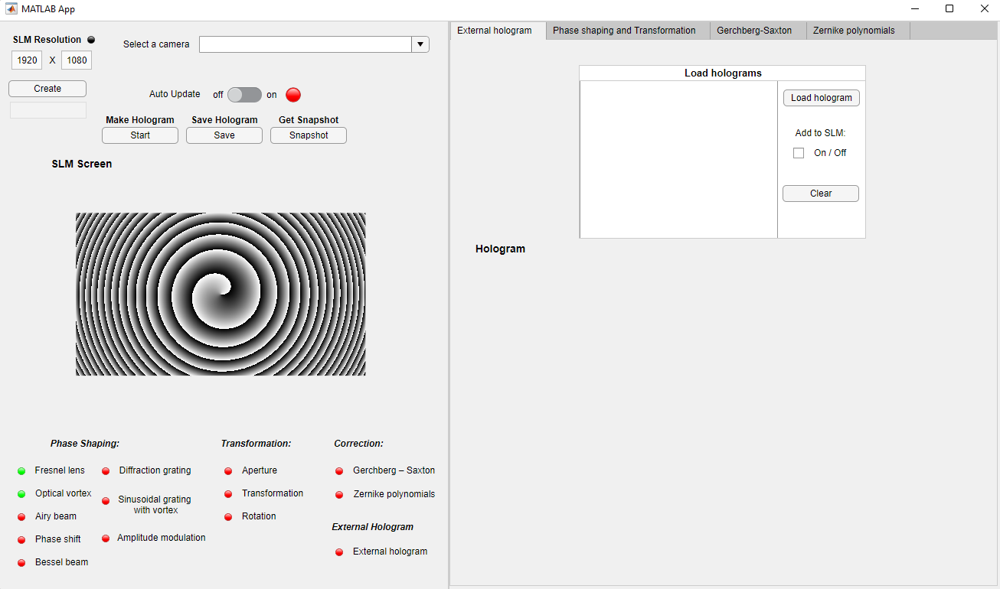

This tutorial provides support for the Laser Beam Shaping Application https://github.com/corlic29/LaserBeamShapingApp/ that operates the Spatial Light Modulator (SLM) together with the external camera, to shape the laser beam. The application works as a complex unit that allows the user to use all of its features within a single application, run through MATLAB software.

To operate, it requires a MATLAB R2020a or newer with an active Image Acquisition Toolbox and optional Add-ons that enable MATLAB – camera communication. 

The application is divided into two sections. The left section stands as an **control** one, allowing the user to see what features are currently implemented and what kind of hologram is currently displayed. The right section is responsible for **beam shaping** - the modification of hologram parameters as well as for operating the beam correction algorithms. 

